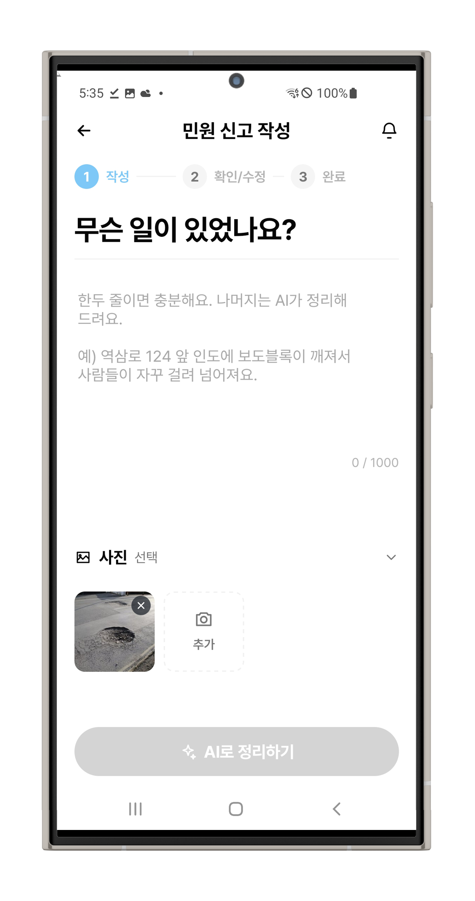
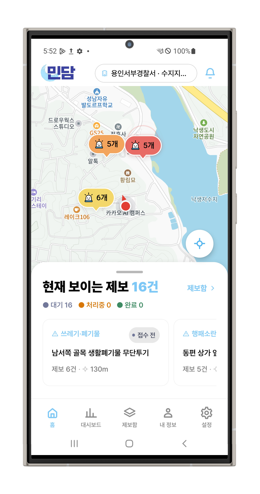
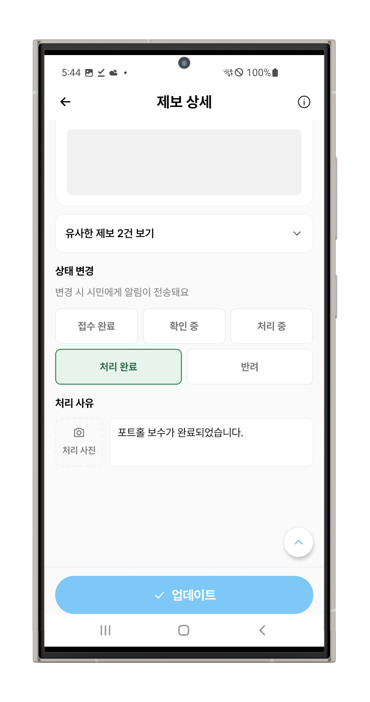
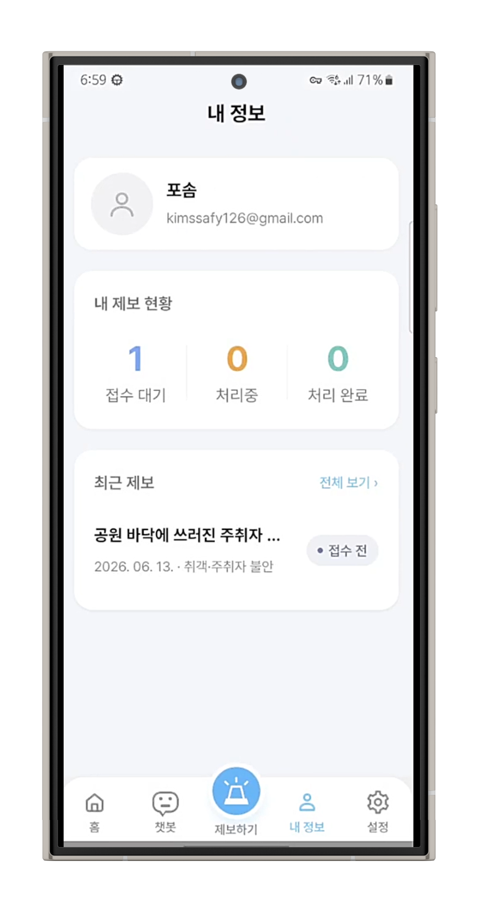
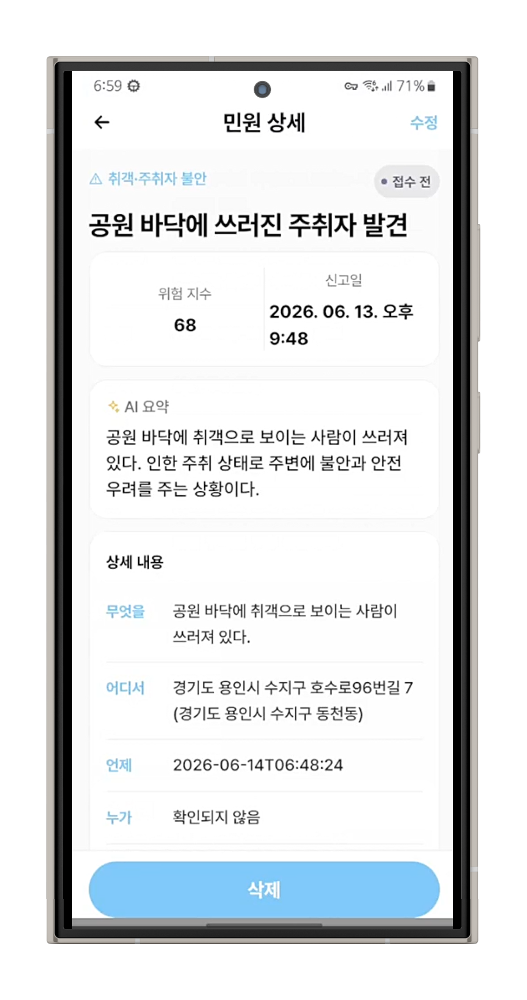
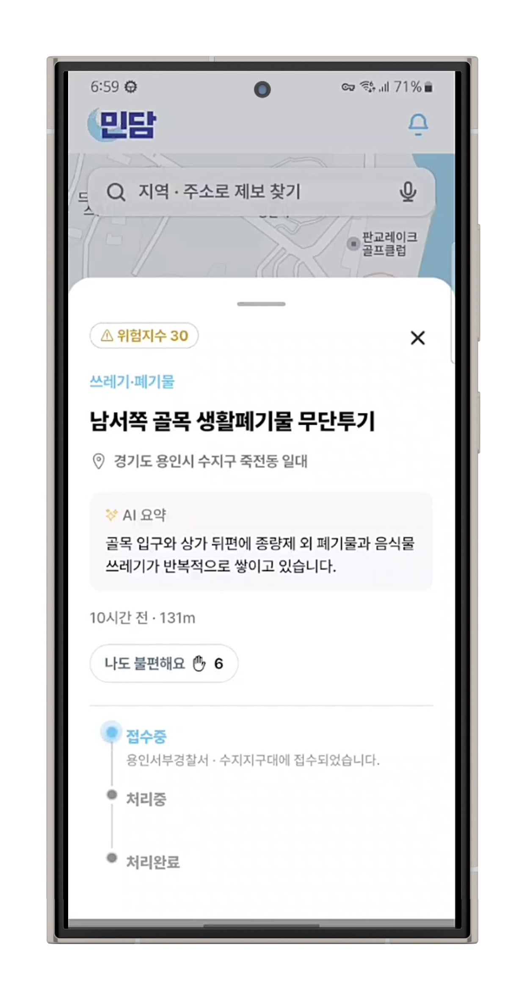

# 민담 프론트엔드

**제보는 쉽게, 처리는 편리하게**


생활 속 위험과 불편을 시민이 빠르게 제보하고, 담당자는 AI가 정리한 정보를 바탕으로 효율적으로 처리할 수 있도록 만든 모바일 민원 제보 서비스입니다.

> `민담`은 `SSAFY X Kakao tech bootcamp AI Hackathon`에서 `카카오 대표이사상`을 수상한 프로젝트입니다.  
> 참고 기사: [카카오·삼성전자, AI 인재 양성 위해 손잡았다… 카카오테크 부트캠프-SSAFY 공동 AI 해커톤 개최](https://www.kakaocorp.com/page/detail/12054)

**이 프로젝트에서 볼 수 있는 것**

- 시민용 간편 제보 흐름
- 지도 기반 민원 조회 UI
- 담당자용 민원 관리 화면
- AI 요약 결과를 반영한 정보 구조

---

## At A Glance

| 항목 | 내용 |
| --- | --- |
| 프로젝트명 | 민담 |
| 프로젝트 성격 | SSAFY X KAKAO BOOTCAMP AI 해커톤 프로젝트 |
| 플랫폼 | Mobile App |
| 주요 사용자 | 시민, 담당자 / 관리자 |
| 프론트엔드 역할 | 시민 제보, 지도 조회, 담당자 관리 화면 구현 |
| 핵심 메시지 | 제보는 쉽게, 처리는 편리하게 |

---

## Problem

- 시민은 싱크홀, 파손된 보도블록, 쓰레기 무단투기, 쓰러진 나무, 길가의 취객 같은 생활 속 위험 상황을 발견해도 어디에 신고해야 할지 모르거나 절차가 번거로워 제보를 망설이기 쉽습니다.
- 기존 민원 서비스는 작성 과정이 복잡하고, 접수 이후 내 민원이 어떻게 처리되고 있는지 확인하기 어렵습니다.
- 담당자 입장에서는 담당 기관이 불분명한 민원, 반복·중복 민원이 많아 처리 효율이 떨어질 수 있습니다.

민담은 이 문제를 해결하기 위해 시민은 쉽게 제보하고, 담당자는 중복 민원과 담당 부서 정보를 빠르게 확인할 수 있는 흐름을 목표로 합니다.

---

## Key Features

### 1. 시민용 제보 플로우

- 한 줄 텍스트와 사진만으로 시작하는 간편 제보 화면
- 위치 정보와 함께 민원 내용을 정리하는 단계형 작성 흐름
- 제보 이후 내 민원 목록과 상세 현황을 확인하는 화면

### 2. 지도 기반 민원 조회 UI

- 현재 위치 주변 민원을 지도 마커로 시각화
- 주변 제보를 카드 형태로 확인하는 모바일 중심 UI
- 시민용 화면과 담당자용 화면에서 목적에 맞게 다른 지도 정보 제공

### 3. 담당자용 민원 관리 화면

- 접수된 민원 목록과 상세 정보 확인
- 접수 대기, 처리 중, 처리 완료 등 상태 기반 UI
- 중복 민원 그룹과 이관 요청 정보를 확인하는 관리 화면

### 4. AI 결과 시각화

- 요약된 민원 정보
- 추천 담당 부서
- 유사 제보와 중복 그룹 정보

프론트엔드는 AI 결과를 그대로 보여주기보다, 사용자가 이해하고 바로 판단에 활용할 수 있는 형태로 재구성하는 데 집중합니다.

---

## Screen Preview

### Core Screens

<table>
  <tr>
    <th width="33%"><div align="center">시민용 제보 화면</div></th>
    <th width="33%"><div align="center">지도 기반 조회 화면</div></th>
    <th width="33%"><div align="center">담당자용 관리 화면</div></th>
  </tr>
  <tr>
    <td align="center">
      
    </td>
    <td align="center">
      
    </td>
    <td align="center">
      
    </td>
  </tr>
  <tr>
    <td>한 줄 텍스트와 사진으로 시작하는 간편 제보 흐름을 보여주는 영역</td>
    <td>현재 위치 주변 민원을 마커와 카드 리스트로 함께 보여주는 홈 화면 영역</td>
    <td>상태 기반 민원 목록과 상세 확인 흐름을 보여주는 담당자 화면 영역</td>
  </tr>
</table>

### Additional Screens

<table>
  <tr>
    <th width="33%"><div align="center">내 민원 조회</div></th>
    <th width="33%"><div align="center">민원 상세 / AI 결과</div></th>
    <th width="33%"><div align="center">민원 상세 추가 화면</div></th>
  </tr>
  <tr>
    <td align="center">
      
    </td>
    <td align="center">
      
    </td>
    <td align="center">
      
    </td>
  </tr>
  <tr>
    <td>사용자가 제출한 민원의 현황을 확인하는 화면</td>
    <td>요약 정보, 추천 담당 부서, 유사 제보를 확인하는 상세 화면</td>
    <td>홈화면에서 민원 상세 정보를 보여주는 화면</td>
  </tr>
</table>

---

## User Flow

### 시민

`로그인 -> 지도 홈 -> 간편 제보 작성 -> 제출 -> 내 민원 조회 -> 상세 확인`

### 담당자

`로그인 / 역할 선택 -> 담당자 홈 -> 접수 민원 확인 -> 상세 확인 -> 상태 변경 / 이관 요청 확인`

---

## Tech Stack

<p align="center">
  
  
  
  
  
  
  
  
</p>

| 구분 | 사용 기술 |
| --- | --- |
| Framework | Expo 54, React Native 0.81, React 19 |
| Language | TypeScript |
| Routing | Expo Router |
| Data / State | TanStack Query, Axios, Zustand |
| Device APIs | Expo Secure Store, Expo Location, Expo Notifications |
| External SDK | Kakao SDK for React Native |

---

## Project Structure

```text
ssiren-frontend/
├── README.md
└── ssiren-app/
    ├── app/                  # expo-router 라우트
    ├── src/
    │   ├── assets/           # 이미지, 폰트
    │   ├── components/       # 공통 UI 컴포넌트
    │   ├── features/         # 기능 단위 모듈
    │   ├── lib/              # API client, 위치 유틸
    │   ├── theme/            # 디자인 토큰, 폰트
    │   └── types/
    ├── app.config.js         # Expo 앱 설정과 플러그인 설정
    ├── app.json
    └── package.json
```

### Route Map

| 경로 | 역할 |
| --- | --- |
| `app/(tabs)` | 시민용 주요 탭 화면 |
| `app/(officer)` | 담당자용 화면 |
| `app/auth` | 로그인 및 역할 선택 흐름 |
| `app/my-reports` | 내 민원 목록 / 상세 |
| `app/officer-report` | 담당자용 민원 상세 |

---

## Getting Started

### 1. Install

```bash
cd ssiren-frontend/ssiren-app
npm install
```

### 2. Environment Variables

`ssiren-frontend/ssiren-app/.env`

```env
EXPO_PUBLIC_API_BASE_URL=
EXPO_PUBLIC_KAKAO_NATIVE_APP_KEY=
EXPO_PUBLIC_KAKAO_MAP_JS_KEY=
```

| 변수명 | 설명 |
| --- | --- |
| `EXPO_PUBLIC_API_BASE_URL` | 백엔드 API 주소 |
| `EXPO_PUBLIC_KAKAO_NATIVE_APP_KEY` | 카카오 로그인 및 네이티브 SDK 초기화에 사용하는 앱 키 |
| `EXPO_PUBLIC_KAKAO_MAP_JS_KEY` | 웹뷰 기반 카카오 지도 SDK 로딩에 사용하는 키 |

### 3. Run

```bash
npm run start
```

```bash
npm run android
npm run ios
npm run web
```

### 4. Runtime Notes

- 개발 환경에서 `EXPO_PUBLIC_API_BASE_URL`이 비어 있거나 `localhost`로 설정되어 있으면, 실기기 Expo 환경에서는 Metro 호스트 IP를 기준으로 API 주소를 자동 보정합니다.
- Android 에뮬레이터에서는 기본적으로 `http://10.0.2.2:8080`을 사용합니다.
- 그 외 환경에서는 기본값으로 `http://localhost:8080`을 사용합니다.

---

## Auth And Permissions

### 인증 / 세션

- 카카오 로그인 후 백엔드에 로그인 요청을 보내 토큰을 발급받습니다.
- 발급된 `accessToken`, `refreshToken`은 `expo-secure-store`에 저장합니다.
- 앱 재실행 시 저장된 토큰으로 세션을 복원합니다.
- 만료된 액세스 토큰은 리프레시 토큰으로 재발급을 시도합니다.

### 권한 / 기능

| 권한 / 기능 | 용도 |
| --- | --- |
| 위치 권한 | 현재 위치 기반 민원 조회 |
| 알림 권한 | 푸시 알림 수신 |
| 카메라 / 사진 접근 권한 | 민원 사진 첨부 |

`app.config.js`에서 함께 관리하는 설정:

- Kakao SDK 플러그인 설정
- `expo-image-picker`
- `expo-notifications`
- Android 위치 / 알림 권한
- `google-services.json` 존재 시 Android Firebase 설정 반영

---

## Frontend Highlights

| 영역 | 구현 포인트 |
| --- | --- |
| 시민용 화면 | 간결한 제보 작성 흐름, 위치 기반 지도, 내 민원 조회 화면을 연결했습니다. |
| 담당자용 화면 | 상태 기반 리스트, 민원 상세, 이관 요청과 중복 민원 확인 흐름을 구성했습니다. |
| AI 결과 표현 | 추천 담당 부서, 유사 제보, 요약 정보처럼 이해하기 쉬운 형태로 재구성했습니다. |

---

## Troubleshooting

| 상황 | 확인할 내용 |
| --- | --- |
| 카카오 로그인이 동작하지 않을 때 | `EXPO_PUBLIC_KAKAO_NATIVE_APP_KEY` 설정 여부, Android / iOS Kakao 앱 설정 확인 |
| 지도 화면이 비어 있을 때 | `EXPO_PUBLIC_KAKAO_MAP_JS_KEY` 설정 여부, 카카오 지도 SDK 키 권한과 플랫폼 설정 확인 |
| 실기기에서 API 호출이 실패할 때 | 백엔드 실행 PC와 같은 네트워크인지 확인하고, 필요하면 `EXPO_PUBLIC_API_BASE_URL` 직접 지정 |
| 푸시 알림 테스트가 안 될 때 | `google-services.json` 존재 여부, 알림 권한, 백엔드 FCM 토큰 등록 API 확인 |
